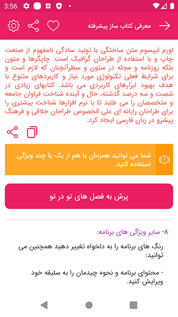

## توضیحات
نوشته هایتان را همراه با مجموعه ای از امکانات محتوا ساز، به راحتی و به سرعت به یک کتاب اندرویدی پیشرفته تبدیل کنید، محتوای شما باید در SQLite (آفلاین) تعریف شود.
## شروع

### موراد مورد نیاز

* نیازمند به نصب نرم افزار [DB Browser for SQLite](https://sqlitebrowser.org/) برای سیستم عامل های Windows/MacOS/Linux

### تنظیمات اولیه
* برای تغییرات و شخصی سازی بیشتر به مسیر BuildApp بروید و آنرا ویرایش کنید.
`ghasemi.abbas.book.BuildApp`
  
    ```java
    public class BuildApp {
    
            static MarketConfiguration MARKET_TYPE = MarketConfiguration.CAFE_BAZAAR; // مارکتی که برنامه در آن منتشر می شود. CAFE_BAZAAR یا MYKET
            public static boolean ENABLE_SPLASH = true; // صفحه آغازین برنامه
            public static int SPLASH_TIME = 2; // مدت زمان ماندن در صفحه آغازین بر حسب ثانیه
            public static boolean OPEN_LINK_IN_APP = true; // لینک ها در خود برنامه باز شوند یا در مرورگر
            public static boolean JUST_CLICK_FOR_EXIT = false; // با یک بار لمس دکمه خروج برنامه خاتمه پیدا می کند
            public static boolean DOUBLE_CLICK_FOR_EXIT = false; // با دوبار لمس دکمه خروج برنامه خاتمه پیدا می کند
            public static boolean ACCESS_COPY = false; // کنترل کپی شدن/نشدن نوشته های خود
            public static boolean ACCESS_SHARE = true; // کنترل اشتراک شدن/نشدن نوشته های خود
            public static boolean ENABLE_DIVIDER = true; // یک خط جدا کننده مابین لیست مطالب شما قرار می گیرد
            public static boolean FINISH_SEASON_LISTED_WITH_ON_LONG_CLICK_BACK = true; // وقتی کاربر چندین فصل از برنامه شما را باز کرده است، تنها با لمس طولانی دکمه خروج از تمامی آنها خارج می شود
            public static CustomFonts FONT_TYPE = CustomFonts.ONE; // فونت پیشفرض برنامه ONE TWO THREE FOUR
            public static String FAVORITE_LIST_TYPE = "classic_list"; // نوع نمایش لیست مطالب در قسمت علاقه مندی ها row_list card_list classic_list
            public static String FIRST_SEASON_LIST_TYPE = "row_list"; // نوع نمایش اولین لیست مطالب row_list card_list classic_list
            public static float GENERAL_FONT_SIZE = 15; // اندازه فونت پیش فرض برنامه
            public static int MINIMUM_FONT_SIZE = 12; // حداقل اندازه فونت
            public static int DEFAULT_FONT_SIZE = 14; // اندازه پیشفرض فونت نوشته ها
            public static int MAXIMUM_FONT_SIZE = 25;// حداکثر اندازه فونت
    
    }
    ```

### اضافه کردن محتوا به برنامه
* حتما دیتابیس نمونه را مشاهده کنید `YOUR-PATH\book\ABook\src\main\assets\db\data.db` .
* مشاهده دیتابیس نمونه شما را با توضیحات زیر و نحوه استفاده از آنها بهتر آشنا می کند
* تصاویر و گیف های آفلاین خود را در پوشه drawable-nodpi  قرار دهید.
* ویدئو و آهنگ های آفلاین خود را در پوشه raw قرار دهید.
* **نکته بسیار مهم:** پس از هربار ایجاد تغییرات در دیتابیس، نیاز است حتما ورژن برنامه افزایش دهید.

 #### اضافه کردن متن:
    [t][?][?]...متن شما
    [t] برای شروع اضافه کردن هر بار متن،تصویر و... الزامی است
    توضیجات برای [?](به کاربردن اختیاری است) (علامت سوال می تواند دستور های زیر باشد):
    [blue] --> تغییر رنگ نوشته استفاده از رنگ دلخواه #4caf50 یا رنگهای پیشفرض blue یا red یا green یا yellow یا orange یا purple
    [r] --> متن راست چین
    [c] --> متن وسط چین
    [l] --> متن چپ چین
    [p] --> با هر بار استفاده متن از گوشه ها مقداری فاصله می گیرد
    [j] --> متن ها را از سمت راست و چپ در اندروید 8 به بالا تراز می کند
    [b] --> متن را بلد می کند
    [alm] --> درصورتی که متن حاوی شماره یا ایمیل و ... باشد آنرا نمایان می کند
    [html] --> درصورتی که متن شما اپ تی ام ال است
    [sh] --> به متن شما اجازه کپی و اشتراک می دهد
    [s:2] --> اندازه متن را به مقدار 2 عدد بزرگ تر می کند
    [s:-1] --> اندازه متن را به مقدار 1 عدد می کاهد
    [f:fontname] --> فونت متن را تغییر می دهد
    نمونه ها:
    [t][l][red] متن را قرمز و چپ چین می کند
    [t][b][html][#4caf50] متن بلد و سبز رنگ می شود همچنین محتوا می تواند اچ تی ام ال باشد

   #### اضافه کردن تصویر (آفلاین|آنلاین): 
    [t][img][z][o][https://address یا imageName]
    توضیحات:
    [z] --> تصویری با قابلیت زوم ایجاد می کند
    [o] --> تصویر را در سایز اصلی خود نمایش می دهد

   #### اضافه کردن ویدئو (آفلاین|آنلاین):
    [t][video][https://address یا videoName]

   #### اضافه کردن آهنگ (آفلاین|آنلاین):
    [t][voice][https://address یا voiceName]

   #### اضافه کردن تصویر یا ویدئو اسلایدر:
    [t][slider][z][https://address یا imageName][v:https://address یا v:videoName][...]...
    توضیحات:
    [z] --> تصاویری با قابلیت زوم ایجاد می کند

   #### اضافه کردن گیف (آفلاین):
    [t][gif][gifName]
    
   #### اضافه کردن خط جدا کننده:
    [t][divider][0 یا 1]
    توضیحات:
    [0] --> یک خط پیوسته
    [1] --> یک خط شکسته
       
   #### اضافه کردن دکمه های خاص:
    [t][ref][توضیحات | پکیج نیم | اکشن | اطلاعات | نام دکمه]
    نمونه ها:
    [t][ref][call|tel:+980000|view]
    [t][ref][email|mailto:example@gmail.com|view||android.intent.extra.SUBJECT ^ YOUR-SUBJECT]
    [t][ref][settings||android.settings.WIFI_SETTINGS|com.android.settings]
    [t][ref][bluetoothSettings||android.settings.BLUETOOTH_SETTINGS|com.android.settings]
    [t][ref][sms|smsto:+980000|view||sms_body^YOUR-MESSAGE]
    [t][ref][openApp||open|com.farsitel.bazaar]
    [t][ref][share|YOUR-TEXT|send||YOUR-TITLE]
    [t][ref][web|https://google.com/|view]
       
   #### اضافه کردن دیالوگ:
    [t][dialog][پیام | عنوان | نام دکمه]
   
   #### دکمه پیام کوتاه:
    [t][toast][پیام | نام دکمه]
       
   #### اضفه کردن دکمه پرش:
    [t][jump][ای دی محل پرش در دیتابیس | نام دکمه]
   
   #### اضافه کردن دکمه کپی:
    [t][copy][نام دکمه | id:1,2,3 or متن]
    توضیحات:
    id:... --> ای دی متنی
          
   #### اضافه کردن هشدار:
    [t][alert][رنگ][هشدار]
    توضیحات:
    رنگ --> 
	استفاده از green یا blue یا red یا orange
   
   #### اضافه کردن تیپ باکس:
    [t][tipbox][متن | عنوان | آدرس آیکن | رنگ]
    توضیحات:
    رنگ -->
	#4caf50 یا blue یا red یا green یا yellow یا orange یا purple
  
## برنامه نویس و پشتیبانی
این پروژه توسط [فراسورس](https://farasource.com/) ایجاد شده است (عباس قاسمی).
> شما می توانید به ما کمک کنید تا پروژه های منبع باز را به روز نگه داریم!
