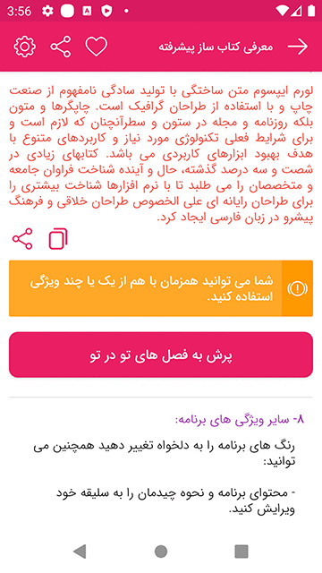

## زبان ها
[مشاهده توضیحات فارسی](https://github.com/farasource/advanced-bookmaker/blob/master/README-FA.md)

## Description

Transform the texts into an advanced android application easily and quickly, your content needs to be defined in the SQLite (offline).

## Getting Started

### Prerequisites

* Need to install [DB Browser for SQLite](https://sqlitebrowser.org/) on Windows/MacOS/Linux

### Setting up
* For more changes and personalising go to this path and edit BuildApp file `ghasemi.abbas.book` .
    ```java
    public class BuildApp {
    
            static MarketConfiguration MARKET_TYPE = MarketConfiguration.CAFE_BAZAAR; //CAFE_BAZAAR MYKET
            public static boolean ENABLE_SPLASH = true;
            public static int SPLASH_TIME = 2; // second
            public static boolean OPEN_LINK_IN_APP = true;
            public static boolean JUST_CLICK_FOR_EXIT = false;
            public static boolean DOUBLE_CLICK_FOR_EXIT = false;
            public static boolean ACCESS_COPY = false;
            public static boolean ACCESS_SHARE = true;
            public static boolean ENABLE_DIVIDER = true;
            public static boolean FINISH_SEASON_LISTED_WITH_ON_LONG_CLICK_BACK = true;
            public static CustomFonts FONT_TYPE = CustomFonts.ONE; // ONE TWO THREE FOUR
            public static String FAVORITE_LIST_TYPE = "classic_list"; // row_list card_list classic_list
            public static String FIRST_SEASON_LIST_TYPE = "row_list"; // row_list card_list classic_list
            public static float GENERAL_FONT_SIZE = 15;
            public static int MINIMUM_FONT_SIZE = 12;
            public static int DEFAULT_FONT_SIZE = 14;
            public static int MAXIMUM_FONT_SIZE = 25;
    
    }
    ```

### Add content
* Check the sample database in this path `YOUR-PATH\book\ABook\src\main\assets\db\data.db` .
* Add offline images and gifs to the drawable-nodpi folder.
* Add offline sounds and videos to the raw folder.

**Important note:** After making changes to the database, you need to increase number of the application's version.
    
   #### Add text:
    [t][?][?]... YOUR-TEXT
    [t] Is necessary
    Description for [?](Optional) (Note that the following are independent of each other):
    [blue] --> Change the color of the text, use #4caf50 Or blue Or red Or green Or yellow Or orange Or purple
    [r] --> Right text
    [c] --> Center text
    [l] --> Left text
    [p] --> Add padding to text, you can use more than once
    [j] --> Jastifa text (Show only on android O and above)
    [b] --> Bold text
    [alm] --> Creates links for numbers, emails and addresses in text
    [html] --> You inform the text is html
    [sh] --> Allows you to share or copy text
    [s:2] --> Increases text size
    [s:-1] --> Reduces text size
    [f:fontname] --> Specifies the font type
    Example:
    [t][l][red] The text on the left is in red
    [t][b][html][#4caf50] The green text you contains html

   #### Add image (online|offline): 
    [t][img][z][o][https://address Or imageName]
    Description:
    [z] --> Is optional and set zoom feature for image
    [o] --> Is optional and set origin image size

   #### Add video (online|offline):
    [t][video][https://address Or videoName]

   #### Add voice (online|offline):
    [t][voice][https://address Or voiceName]

   #### Add image or video slider:
    [t][slider][z][https://address Or imageName][v:https://address Or v:videoName][...]...
    Description:
    [z] --> Is optional and set zoom feature for images

   #### Add gif (offline):
    [t][gif][gifName]
    
   #### Add divider:
    [t][divider][0 Or 1]
    Description:
    [0]Or[1] Is necessary
    [0] --> Is line divider
    [1] --> Is dash divider
       
   #### Add reference button:
    [t][ref][btnName | data | action | packageId | description]
    Example:
    [t][ref][call|tel:+980000|view]
    [t][ref][email|mailto:example@gmail.com|view||android.intent.extra.SUBJECT ^ YOUR-SUBJECT]
    [t][ref][settings||android.settings.WIFI_SETTINGS|com.android.settings]
    [t][ref][bluetoothSettings||android.settings.BLUETOOTH_SETTINGS|com.android.settings]
    [t][ref][sms|smsto:+980000|view||sms_body^YOUR-MESSAGE]
    [t][ref][openApp||open|com.farsitel.bazaar]
    [t][ref][share|YOUR-TEXT|send||YOUR-TITLE]
    [t][ref][web|https://google.com/|view]
       
   #### Add dialog button:
    [t][dialog][btnName | YOUR-TITLE | YOUR-MESSAGE]
   
   #### Add toast button:
    [t][toast][btnName | YOUR-MESSAGE]
       
   #### Add jump button:
    [t][jump][btnName | rowIdInSqlite]
   
   #### Add copy button:
    [t][copy][btnName | id:1,2,3 Or YOUR-CUSTOM-TEXT]
    Description:
    id:... --> Is textId
          
   #### Add alert message:
    [t][alert][color][YOUR-MESSAGE]
    Description:
    color --> Use green Or blue Or red Or orange
   
   #### Add tipbox message:
    [t][tipbox][color | iconName | YOUR-TITLE | YOUR-MESSAGE]
    Description:
    color --> Use #4caf50 Or blue Or red Or green Or yellow Or orange Or purple
  
## Author & support
This project was created by [Farasource](https://farasource.com/) (Abbas Ghasemi).
> You can help us to keep my open source projects up to date!
